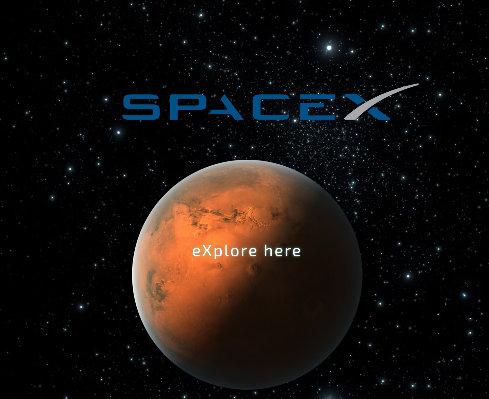

# _SpaceX Capstone_

#### _Dec 22, 2016_

#### By _**Ellie Angell**_

## Description
 This week's code review must include: A capstone project of our choosing. I have chosen to redo the SpaceX website.

 See it live [here](https://ellie-a.github.io/spacex-capstone)

## Setup/Installation Requirements

1. Download this repo: (https://github.com/ellie-a/spacex-capstone)  using your terminal: git clone repo-name pasted here

2. View the code by drag-and-dropping the file into your [favorite text editor](https://atom.io)

3. run/check-out the program by dropping the index/html file from your folder into your web browser

Install Sass/Bourbon/Neat:

## Known Bugs

_So far not responsive_

## Support and contact details

For questions or comments, please __email  [Ellie here.](elliea915@gmail.com)__

## Technologies Used

* HTML5
* CSS3 with Sass, Bourbon and Neat
* JavaScript with jQuery 3.1

### License

Copyright (c) 2016 **_Ellie Angell_**

This program is free software: you can redistribute it and/or modify
    it under the terms of the GNU General Public License as published by
    the Free Software Foundation, either version 3 of the License, or
    (at your option) any later version.

    This program is distributed in the hope that it will be useful,
    but WITHOUT ANY WARRANTY; without even the implied warranty of
    MERCHANTABILITY or FITNESS FOR A PARTICULAR PURPOSE.  See the
    GNU General Public License for more details.

    You should have received a copy of the GNU General Public License
    along with this program.  If not, see <http://www.gnu.org/licenses/>.
